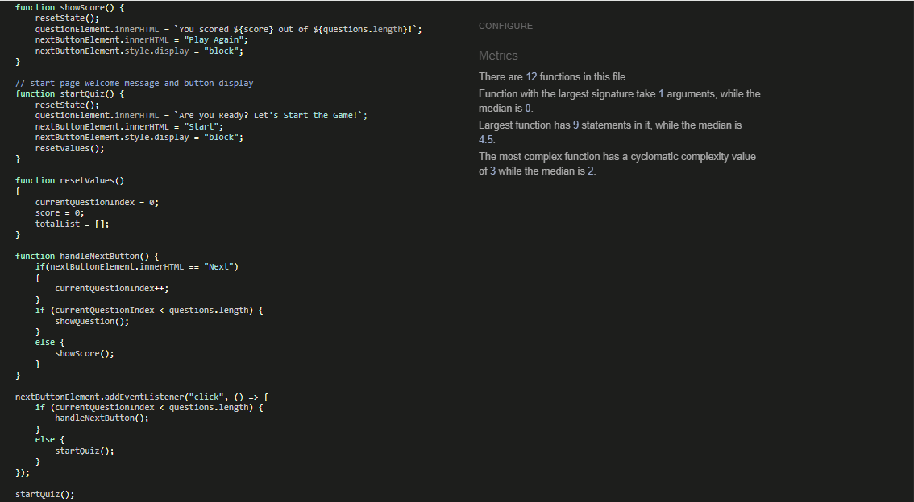
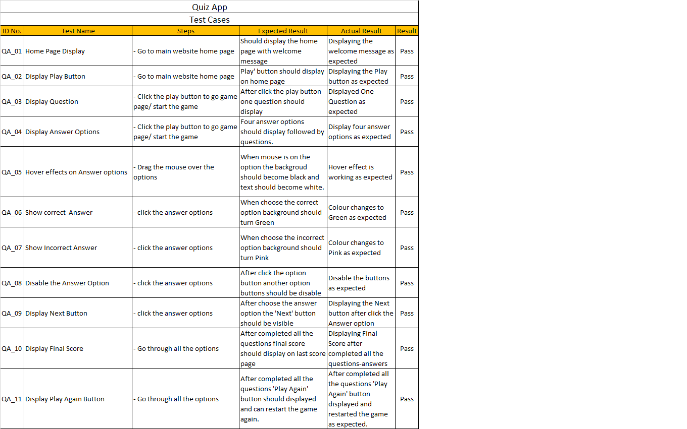

<h1 align="center">Quizz App</h1>

[View the live Project here](https://jyotihambir-bc.github.io/Quiz-Game/)

Quiz App made for entertainment with general knowledge questions about of the Food. While playing the app someone can increase his/her knowledge about the worldwide food.

  - ## Index – Table of Contents
  * [User Experience (UX)](#user-experience-ux)
  * [Features](#features)
  * [Design](#design)
  * [Technology Used](#technology-used)
  * [Testing](#testing)
  * [Deployment](#deployment)
  * [Credits](#credits)

  - ## User Experience (UX)
  
  - ### User Stories
    - [User Stories](assets/documents/user-story-images/User-story-image.PNG)

  - #### Start Page
    1. As a User I can see the Start button and welcome message so that I can start the game after clicked Start button.

  - #### Game Page
    1. As a User I can able to click the option provided so that I can choose the answer.
    2. As a User I am able to click on the another option again once selected one so that I cannot change the answer once clicked on the option.
    3. As a User I can able to see if the answer is correct or not after clicked on the option so that I can know my answer status if it is correct or incorrect on the spot.
    4. As a User I can able to click on Next button and only visible after selected the answer so that I can go on further for next question answer.
    

  - #### Score Page
    1. As a User I can able to see my game's final score so that I can understand how much I scored.
    2. As a User I can restart the game after finish it so that I can play the game again.

  - ## Features

  - ### Existing Features
   
    - _01 Start Page Images_ 
      -  On the start page we can see welcome message with play button is there. Play button is having hover effect which make him more attractive on a start page.
        

    - _02 Game Page_ 
      - On a game page we can see one question with four options. From that one answer is correct and another three are incorrect.
      - For true answer option I have set the background colour GREEN and for incorrect option it is set PINK. If we select the wrong option it's background colour become pink and immediatly it show the correct option.
      - After select one option another options become disable means we can't change the option after select one. These option buttons also have hover effects. 
        
        

    - _03 Score Page_ 
      - On score page we can see the total score of the game. Also there is Play Again button to restart the game. This button also have the hover effect.
         
      
   

  - ### Features which could be implemented in future
    - _Game Page_
      - Currently the game containing only 10 questions, in future I am going to add more questions to make the game more interesting. 
      - Also going to add some animation which will create pop-up when we click correct and incorrect answer.
      - Screen reader to be added for visually imparaired players.

  - ## Design
  
  - ### Imagery
    - The hero image was choose because it is relavant to app and eye-catching. This image is simple and elegant with content and colour itself.
    

  - ### Typography
      - Google font - Google Fonts were used to import Poppins fonts into index.html

  - ### Wireframes
     
   - #### Start Page Wireframes

        

   - #### Game Page Wireframes
        

   - #### Score Page Wireframes
        
  
  
  - ## Technology Used

  - ### Language Used
    - [HTML5](https://en.wikipedia.org/wiki/HTML5)
    - [CSS3](https://en.wikipedia.org/wiki/CSS)
    - [JavaScript](https://simple.wikipedia.org/wiki/JavaScript)

  - ### Frameworks, Libraries
    - [Google Font](https://fonts.google.com/) was used to import Poppins font, which is used in app.
    - [Balsamiq](https://balsamiq.com/) was used to create a wireframe during design process.
  
  - ## Testing
      
  - ### Validator Testing

    - [HTML Validator](https://validator.w3.org/)
      - 
        
    - [CSS Validator]()
       - 

    - [JavaScript Validator](https://jshint.com/)
      - 

  - ### Test Cases and Results
    - 

  - ## Deployment

  - ### How this site was deployed

    - In the GitHub repository, navigate to the Settings tab, then choose Pages from the left hand menu 
    - From the source section drop-down menu, select the Master Branch
    - Once the master branch has been selected, the page will be automatically refreshed with a detailed  ribbon display to indicate the successful deployment
    - Any changes pushed to the master branch will take effect on the live project.

    The live link can be found here - [Quiz App](https://jyotihambir-bc.github.io/Quiz-Game/)

  - ## Credits

  - ### Content
    - Other content like incorrect options were written by developer. 

  - ### Code
    - App Idea and code idea was taken from [GreasStack](https://www.youtube.com/watch?v=PBcqGxrr9g8)
    - Developer written own code for randomly and unique (no repeatation) questions sequense.

 - ### Media
    - Hero images was downloaded from [Freepik](https://www.freepik.com/free-photos-vectors/blue-question-mark)
    - Questions are taken from [KwizzBit](https://kwizzbit.com/food-and-drink-quiz-questions-and-answers/)

 - ### Acknowledgments

    - Thank you my facilitator Elaine Roche who supported me in this project with suggestion in coding and how to make the app responsive. She took regular followup and helped with any road blocks came in this project. 
    - Thank you Coding Coach Mark Briscoe who guided me in coding with showing live example of writing a clean code and answered all coding queries patiently and provide understandable solutions. 

  